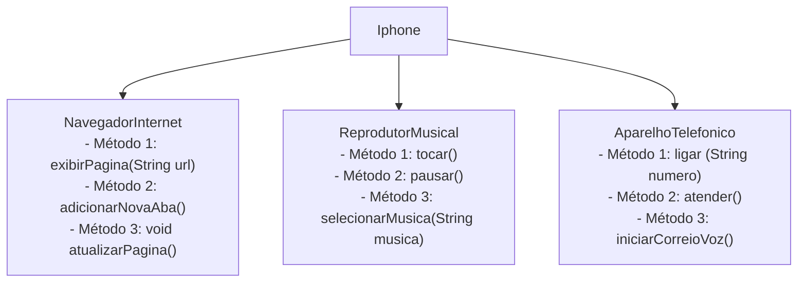

```mermaid
graph 
C[Iphone]; C --> D["NavegadorInternet<br/>- Método 1: exibirPagina(String url)<br/>- Método 2: adicionarNovaAba()<br/>- Método 3: void atualizarPagina()"]; C --> E["ReprodutorMusical<br/>- Método 1: tocar()<br/>- Método 2: pausar()<br/>- Método 3: selecionarMusica(String musica)"]; C --> F["AparelhoTelefonico<br/>- Método 1: ligar (String numero)<br/>- Método 2: atender()<br/>- Método 3: iniciarCorreioVoz()"];
```